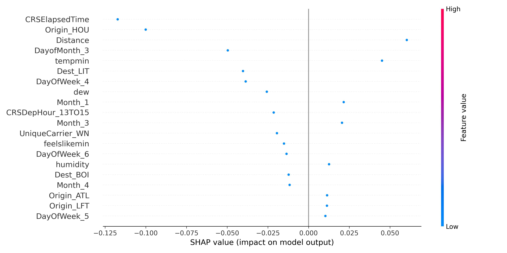
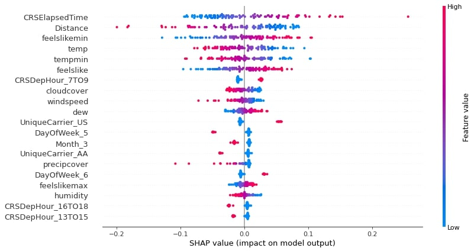

## Neural Network

### Training Model
We have combined the dataset with externel weather data to train neural network model.
The predictors used to train the neural network model are:

```
['Month', 'DayofMonth', 'DayOfWeek', 'CRSDepTime', 'CRSArrTime',
'UniqueCarrier', 'CRSElapsedTime', 'ArrDelay', 'Origin', 'Dest',
'Distance', 'tempmax', 'tempmin', 'temp', 'feelslikemax',
'feelslikemin', 'feelslike', 'dew', 'humidity', 'precip', 'precipprob',
'precipcover', 'snow', 'snowdepth', 'windspeed', 'winddir',
'sealevelpressure', 'cloudcover', 'visibility', 'conditions']
```

For departure and arrival time, they are divided into 3-hour long intervals.

Due to insufficient RAM, only 8% of the data are used as training dataset, while 2% of data are used as test dataset.

The neural network model consists of 2 hidden layers with 64 and 32 dimensions. ReLU activation function is also applied within each hidden layer. The model is trained for 50 epochs.

Running *neural_network_model.py* will generate two files:
1. *neural_network_model.pkl*: Neural netwrok model
2. *train_mean.csv*: Mean value of all predictors in training dataset (will be used for shap value calculation)

### SHAP Value
SHAP value is used to identify the important features that help to predict the flight delay. Taking a record containing the neccessary information as input, `calculate_shap_values` function will output the SHAP values and preprocessed input, and `generate_plot` will take both of them as input and generate SHAP value plot.


If the input contains multiple records, then the plot generated will contain multiple points.


### Limitations
Accuracy of neural network model is around 0.59 which is not very high.
Since the model does not perform very well, the important variables identified by the model are not very convincing.

Training of neural network model only done on 2008 data, which only has Months from Jan to Apr. Furthermore, only 8% of data are used for training.