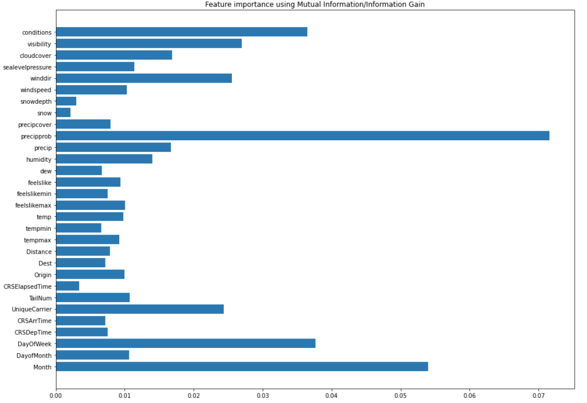

## Setup api for backend

### Running locally

In terminal, run:
```
export FLASK_APP=main
```
```
flask run
```

### Running on docker (not tested)

Run:
```
docker build -t api .
```
```
docker run api
```

### Calling api

For now, only 2 endpoints set up <br>
- http://127.0.0.1:5000/api/lime_fi
- http://127.0.0.1:5000/api/lime_plot
- http://127.0.0.1:5000/api/xgb_predict

Example usage are shown in *callingAPI.py*

### Feature importance
1. Decision Tree


2. LightGBM + LIME
   - Plain flight data
   
   - Flight data + weather data
   

3. Neural Network


4. Statistical Test
   - Chi-square
   
   - ANOVA F-score
   
   - Information Gain
   

5. Time Series Analysis


6. XGBoost
