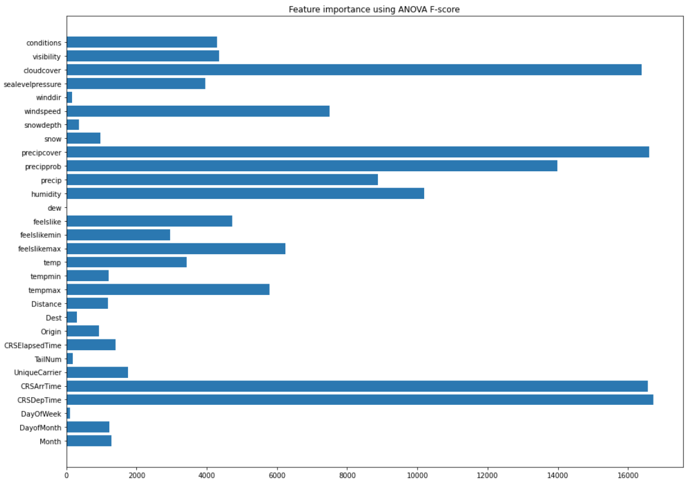

## Feature importance using Statistical Test
To reproduce plots for statistical test: <br>
Run
``` 
python3 statsTests.py
```

### Feature importance using Chi-squared Test


### Feature importance using Mutual Information


### Feature importance using ANOVA F-value


### Testing for Data Drift
This assumes the reference data is the 2008 flights data as it is what our models were trained on. <br>
For now, our ["new data"](../../database/data/test/) is what we use to test if there is a data drift. <br>
To test with new data or if there is a change in reference data, change the relative file paths in *data_drift.py*. <br>
For numerical features, we are performing Kolmogorov-Smirnov test while for categorical features, we are performing Chi-Square test.
Run
```
python3 data_drift.py
```