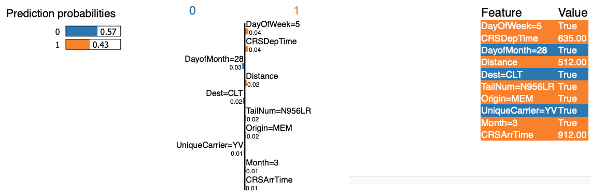

## Using LIME and LightGBM to view feature importance

Classes are labeled as 0 for no delay; 1 for delay on arrival.
LIME generates the feature importance for a single input.
Feature importance may hence vary across different inputs.

Current sample input is on line 22 of *output.py*

### View feature importance as list
Run 
```
python3 output.py
```

### View feature importance as html page
Uncomment line 36 of *output.py*
Output should look like this 

### Limitations
Accuracy of LightGBM model is only 0.62 which is not very high.
Feature importance values are also low due to the use of categorical features
Training of LightGBM model only done on 2008 data, which only has Months from Jan to Apr.